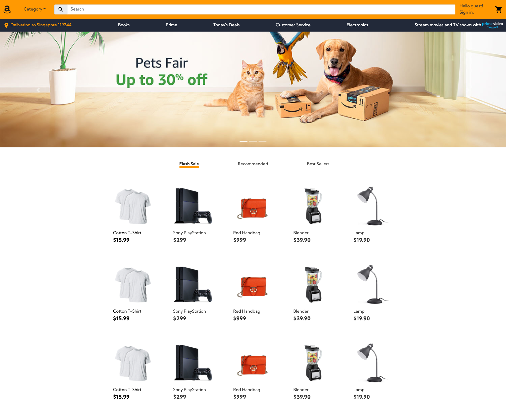

For this assignment, I'm redesigning Amazon's landing, product and checkout pages.

These designs are best fit for desktop.

**[Assignment 1](files/assignment1.md)**

🌟 [Balsamiq Wireframe](files/balsamiq_wireframes.pdf)

**[Assignment 2](files/assignment2.md)**

🌟 [Figma Mockup](https://www.figma.com/file/TCeDYASrWWNN30PiyGJIVb/Amazon?node-id=0%3A1)

🌟 [Figma Presentation](https://www.figma.com/proto/TCeDYASrWWNN30PiyGJIVb/Amazon?node-id=4%3A3&scaling=min-zoom)

**[Assignment 3](files/assignment3.md)**

🌟 [Website](https://hellodommy.github.io/amazon-redesign/)

